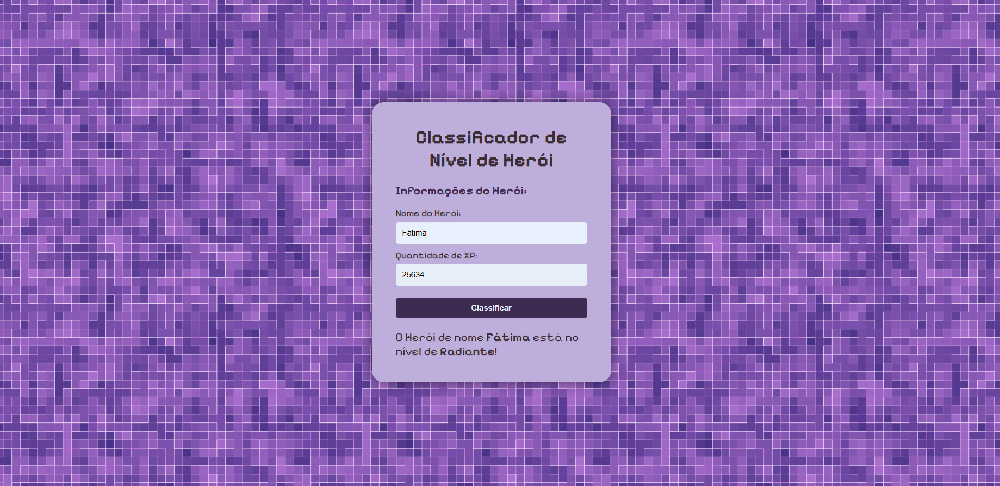

# Classificador de Nível de Herói

Projeto criado como parte do desafio do curso **"Ri Happy - Front-end do Zero"** na plataforma [Digital Innovation One (DIO)](https://www.dio.me/).

## Sobre

Uma aplicação simples que recebe o nome e a quantidade de XP de um herói e retorna seu nível de acordo com a tabela fornecida no desafio.

## Tecnologias

- HTML5
- CSS3
- JavaScript

## Níveis de Classificação

| Faixa de XP        | Nível       |
|--------------------|-------------|
| Menor que 1000     | Ferro       |
| 1001 - 2000        | Bronze      |
| 2001 - 5000        | Prata       |
| 5001 - 7000        | Ouro        |
| 7001 - 8000        | Platina     |
| 8001 - 9000        | Ascendente  |
| 9001 - 10000       | Imortal     |
| Maior que 10000    | Radiante    |

## Preview

## Aprendizados

- Uso de eventos no JavaScript
- Manipulação de DOM
- Estruturas condicionais
- Estilização com CSS

Desenvolvido por [Ana Carolina de Fátima](https://github.com/carolinadefatima)
